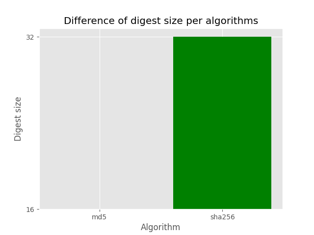
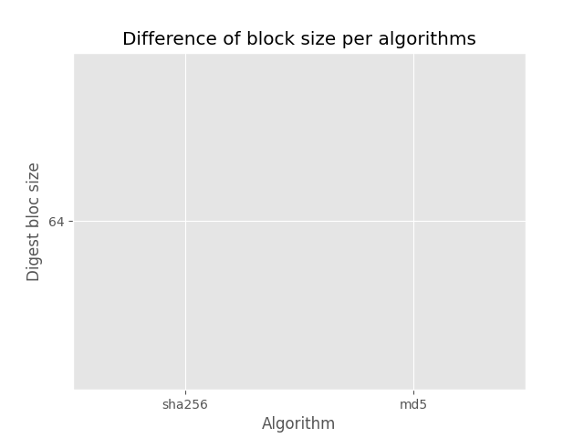
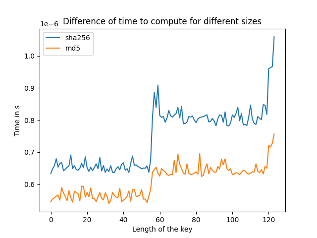

# Comparison of time differences for the algs : sha256, md5
Length|sha256|md5
-|-|-
0|6.378488000336802e-07|5.421718997240532e-07
1|6.748307998350356e-07|5.472173997986829e-07
2|7.07744799728971e-07|5.643774999043672e-07
3|6.764205998479156e-07|5.865674000233412e-07
4|6.737353000062285e-07|5.904953999561257e-07
5|6.534826999995858e-07|5.622824999591103e-07
6|6.660841998382238e-07|5.830084999615792e-07
7|6.6285320026509e-07|5.801350002002436e-07
8|6.558769000548637e-07|5.815959000756265e-07
9|6.905728001584066e-07|5.684800999006256e-07
10|6.696624997857725e-07|5.632776999846101e-07
11|6.612523000512738e-07|6.133744001999731e-07

